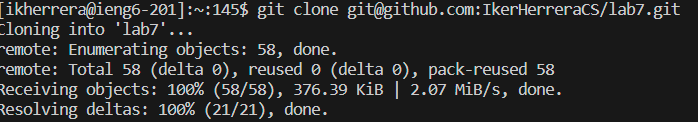

\
Keys pressed: ssh `<space>` ikherrera@ieng6.ucsd.edu `<enter>`\
This command connected and logged me in to the ieng6 machine.\
\
Keys pressed: git `<space>` clone `<space>` `<CTRL> V` `<enter>` git@github.com:IkerHerreraCS/lab7.git `<enter>`\
This command cloned the fork from my Github repository onto the ieng6 machine.\
\
Keys pressed: cd `<space>` lab7 `<enter>` ls `<enter>` bash `<space>` test.sh `<enter>`\
These commands allowed me to see the name of the test script and be able to run it by\
going to the home directory, looking at the files inside of it, and running the test script.
\
Keys pressed: vim `<space>` ListExamples.java `<enter>` 43J `<enter>` 11L `<enter>` x `<enter>`\
i `<enter>` 2 `<enter>` `<Esc>` :wq\
These key presses opened the code in vim, navigated to the error, then edited it to be correct, and\
saved all the changes and quit.
\
Keys pressed: bash `<space>` test.sh `<enter>`\
This command run the tests again and shows that they passed.\
\
Keys pressed: git `<space>` add `<space>` . `<enter>`\
This command added all the changes made.\
\
Keys pressed: git `<space>` commit `<space>` -m `<space>` "Lab 7 done" `<enter>`\
This command saved the current state of the directory.\
\
Keys pressed: git `<space>` push `<space>` origin `<space>` main `<enter>`\
This command uploaded the local repository to the online repository on Github.
