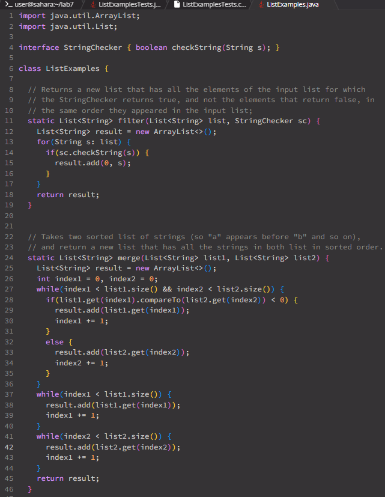

Part 1 – Debugging Scenario
=============================
Student Post
--------------
\
\
\
My code is supposed to merge two lists together into one list.\
The tests to make sure it running correctly are failing.\
I think it has something to do with the merge method.

TA Response
--------------
What is the merge method returning?\
Is there a certain list not merging correctly?

Student Response
--------------------
\
\
After reviewing the code in the merge method,\
there was an error on line 43 where `index1` was\
being updated instead of `index2`.\
After I fixed that the tests started to pass.

Info
-------------
File/Directory Structure:\
\
Contents of Files Before Bug Fix:\
\
\
Bug Trigger:\
\
`bash test.sh`\
Bug Fix:\
Went to ListExamples.java file, and on line 43,\
changed `index1` to `index2`.

Part 2 - Reflection
===================
Cool things that I learned from the labs this quarter were how to\
edit files using vim, and how to use GitHub. Using vim now lets me\
be able to edit files directly from the directory. Being able to use\
GitHub also now lets me work on code more easily with others and be\
able to save my code somewhere else than my own computer.

