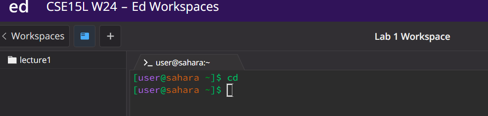
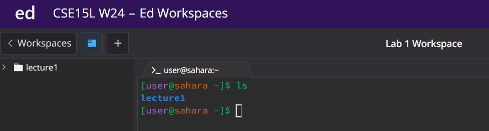
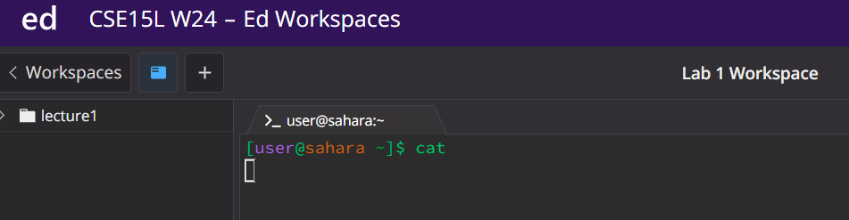
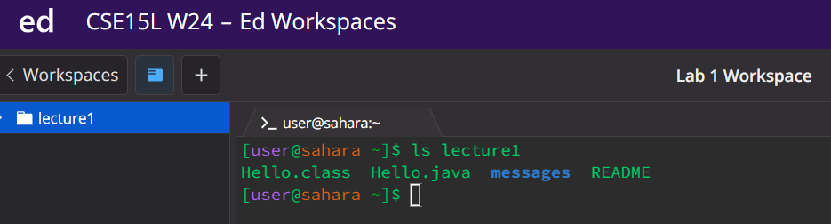
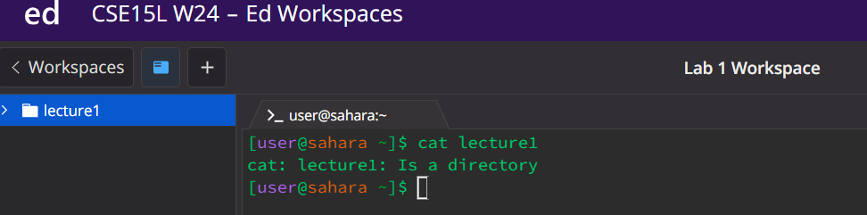
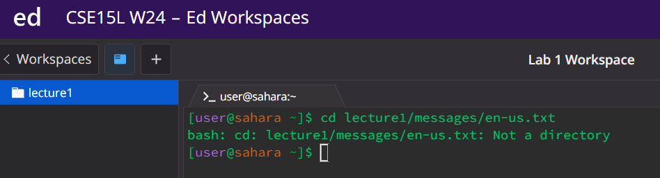
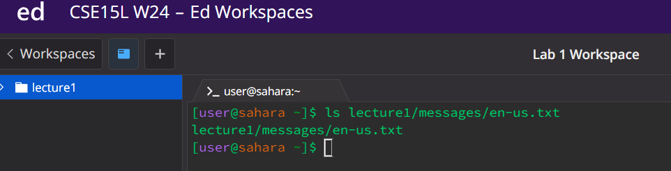
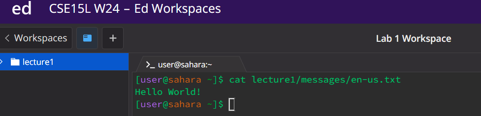

Lab Report 1 - Remote Access and FileSystem
===========================================

\
Working directory: `/home`\
The terminal did not output anything, and the working directory remained the same.\
This happened because the working directory was already /home which is the directory that `cd` 
without any arguments defaults to.\
The output is not an error.\
\
Working directory: `/home`\
When `ls` was used with no arguments, all the files and directories availabe from the home directory were listed.\
The terminal displayed lecture1 in blue text because it was the only directory in the home directory.\
The output is not an error.\
\
Working directory: `/home`\
When `cat` was used with no arguments, the empty terminal is being displayed.\
When you type something and hit enter it is printed out in the terminal.\
To end the command you need to use ^C.\
The output is not an error.\
\
Working directory: `/home`\
When `cd` was used with the argument lecture1, the working directory was changed to /home/lecture1.\
The output is not an error.\
\
Working directory: `/home`\
When `ls` was used with the argument lecture1, Hello.class, Hello.java, messages, and README were outputed.\
This happened because these were the files and directories located inside the lecture1 directory.\
The output is not an error.\
\
Working directory: `/home`\
When `cat` is used with the argument lecture1, (cat: lecture1: Is a directory) is outputed.\
This happens because you cannot use the `cat` command on a directory.\
This output is an error because the command did not run successfully.\
\
Working directory: `/home`\
When `cd` is used with the argument lecture1/messages/en-us.txt, (bash: cd: lecture1/messages/en-us.txt: Not a directory) is outputed.\
This happens because you cannot change your directory to a file.\
The output is an error because the command did not run successfully.\
\
Working directory: `/home`\
When `ls` is used with the argument lecture1/messages/en-us.txt, lecture1/messages/en-us.txt was outputed.\
When you use the `ls` command with a file as an argument, the file used as an argument is outputed because it is the only file that can be listed.\
The output is not an error.\
\
Working directory: `/home`\
When `cat` is used with the argument lecture1/messages/en-us.txt, Hello World! is outputed.\
This happens because the `cat` command prints whatever is stored inside a file.\
The output is not an error.\
