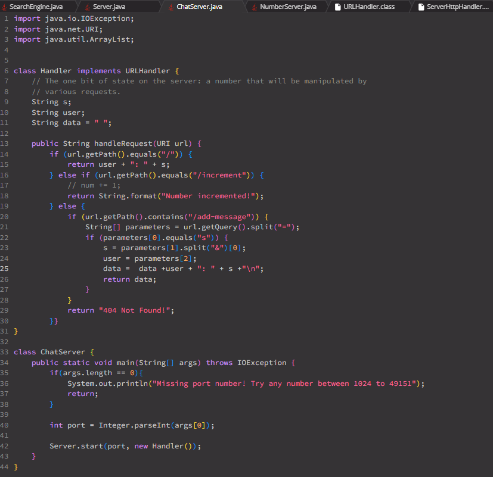
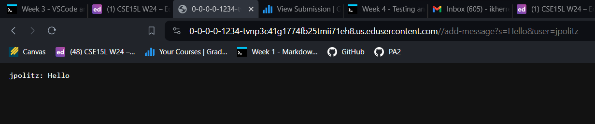
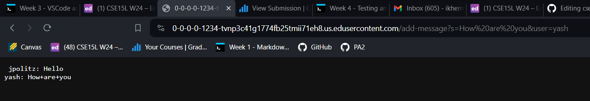
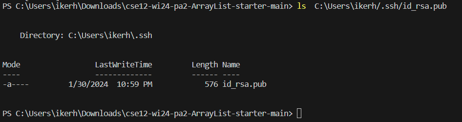
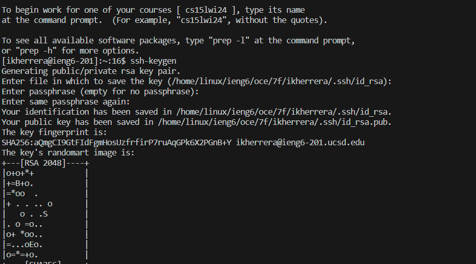
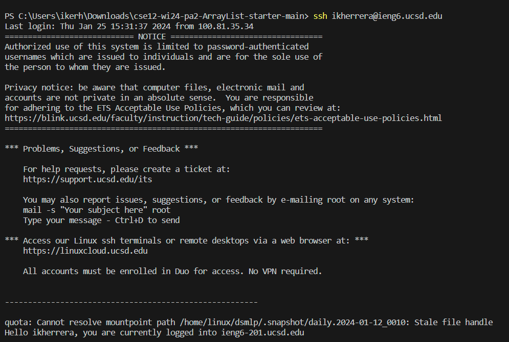

Lab Report 3
==================
\
\
The methods that were called were `handleRequest` and `ChatServer`\
The relevant arguments are the URL for `handleRequest` and the port number for `ChatServer`\
The `s` and `user` fields are altered from the `handleRequest` arguments.\
The `port` field is altered from the `ChatServer` arguments.\
\
The methods that were called were `handleRequest` and `ChatServer`\
The relevant arguments are the URL for `handleRequest` and the port number for `ChatServer`\
The `s` and `user` fields are altered from the `handleRequest` arguments.\
The `port` field is altered from the `ChatServer` arguments.\

Part 2
========================
\
\
\

Part 3
===================
Something I learned from lab 3 was what the `scp` and `mkdir` commands do. The `scp` command copies files between two systems.\
The `mkdir` makes new directories.

